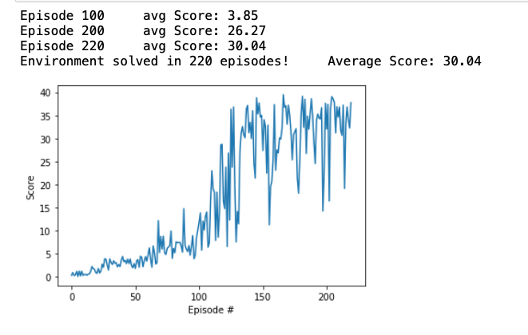

# Project 2 Continuous Control - Report

## Motivation and Results

The Resulting Agent behaves in the environment like this:<br>


Three general emergent Behaviours can be observed:

1. The Agent runs towards yellow bananas if they are reasonably close
2. The Agent avoids blue bananas
3. If there is neither a blue, nor a yellow banana in the screen the agent mostly pans to the left‚

The Agent was trained within 548 episodes: <br>


## Learning Algorithm

Deep Deterministic Policy Gradient (DDPG) was used to train the agent.

### State and Action Spaces

The state space consists of 37 dimensions of ray based perception in the forward direction.

The action space consists of 4 continuous actions:


The Agent consists of two networks.

### Implementation of DQN


#### Action
The action is selected using the epsilon greedy function and the local network.

#### Replay Buffer
After a state action reward, next_state pair was observed by the agent, it gets stored in the replay buffer, in order to randomly sample these experiences after UPDATE_EVERY timestep.


#### Learning

Because of its importance the function used for learning will be explained more in the following:

```python
states, actions, rewards, next_states, dones = experiences
# Get max predicted Q values (for next states) from target model
# running forward on the target network on the set of experiences
Q_targets_next = self.qnetwork_target.forward(next_states).detach().max(1)[0].unsqueeze(1)
# Compute Q targets for current states
Q_targets = rewards + (gamma * Q_targets_next * (1 - dones))
# Get expected Q values from local model
Q_expected = self.qnetwork_local.forward(states).gather(1, actions)
# Compute loss
loss = F.mse_loss(Q_expected, Q_targets)
# Minimize the loss
self.optimizer.zero_grad()
loss.backward()
self.optimizer.step()

self.soft_updatee(self.qnetwork_local, self.qnetwork_target, TAU)
```
At first the states, actions, rewards, next states are extracted from the experiences.<br>
Then the next_states are taken as inputs to the target q network.<br>
The max state value returned from the target network is then used as an estimate of the value of the next state.<br>
This result gets added together with the rewards received and used as an estimate for the value of the action taken at the current state.
The expected value of the states is obtained using the local network,
After this the loss function can be computed using the expected value and the target value.

And therefore the network can be trained by the optimizer trough backpropagation.

#### Soft Updating

After this the target network is updated using the weights and biases from the trained local network and a factor Tau.
Tau determines how fast the target network should adopt the weights and biases from the local network.

Just copying the values of the local network to the target network was observed to be unstable.

### Model Architecture of Neural Model

####Structure
The neural model consists of three fully connected layers. <br>
The first layer has inputs corresponding to the statespace and 64 nodes.<br>
The second layer has inputs corresponding the 64 nodes of the first network and 64 nodes of it own.<br>
The third layer has inputs corresponding to the 64 nodes in the second layer and 4 nodes corresponding to the action state.

#### Optimizer
The chosen optimizer is Adam.
### Hyperparameters

#### Epsilon
The value for epsilon starts with 1.
This means a 100% exploratory policy.
With each episode the epsilon decays by a factor of 0.995 until it has reached epsilon min: 0.1

#### Minibatch size
The minibatch size is the size of the batch used to learn by using gradient descent. <br>
One minibatch is sampled from the replay buffer.<br>
The chosen minibatch size is 70

### Gamma
Gamma is the discount factor.<br>
Ranging from 0 to 1 <br>
Bigger values of gamma correspond to a policy that values future reward just as much as immediate.<br>
The chosen value for gamma is 0.992

### Learning Rate
The Learning rate is used for the adam optimizer.
It determines how big the gradient descent steps are.
The Learning rate is set to 0.0005

### Update-Every
Update-Every determines after what amount of actions the learning should occur.<br>
The selected value for Update-Every is 10.

### Tau
Tau is used for soft update of target parameters.
Larger values for tau were observed to have a hard time learning at the beginning but perform better eventually.<br>
The selected value of Tau is 0.002

###Buffer Size
The constant BUFFER_SIZE determines the maximum amount of experiences that can be stored in the ReplayBuffer. <br>
The value chosen for this Project is 100000

## Ideas for Future Work

### Recurrent Neural Networks

One of the biggest challanges the algorithm faces is, that it gets confused when all bananas are to far away. Instead of
running to the nearest banana the agent continuously pans (mostly to the left). Because the agent only has the current
visual field around itself and therfore no memory of bananas that might be outside the field of view, it makes sense to
pan around and potentially find a banana that might be closer.

One way to mitigate this could be to implement a recurrent neural network, that allows the agent to remember which
bananas are beyond the current field of view.

## Results with Visual Banana

I did not have much success training the VisualBanana Agent. Potentially it could be improved by improving the
hyperparameters, but trying to train the agent took to long to adjust the hyperparameters in a reasonable timeframe and
was therefore abandoned.

