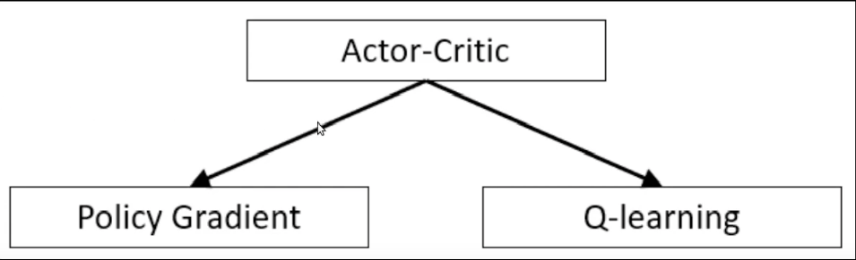

#Roadmap
In this document I will write down my strategies for solving the Continuous Control Problem

##A2C
The A2C algorithm will be the primary algorithm for this project

(source https://www.youtube.com/watch?v=asBFJACi698&t=487s)

# The Critic

The critics job is to evaluate how good a certain state is 
